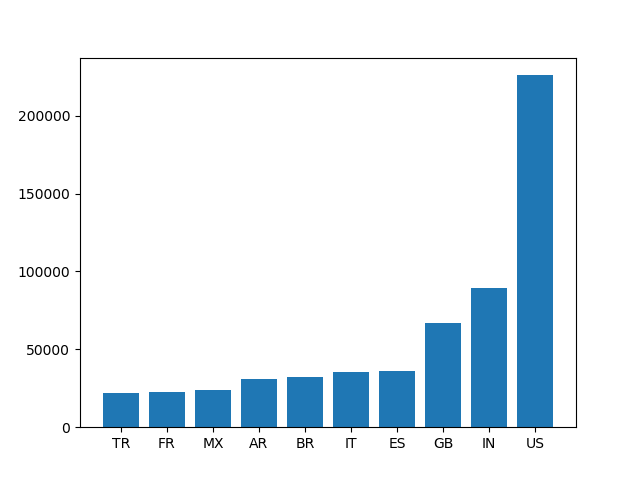
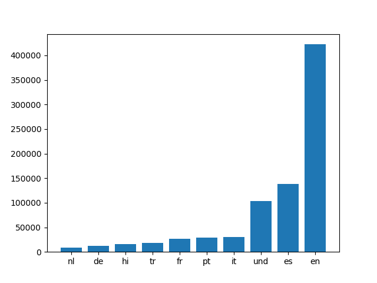
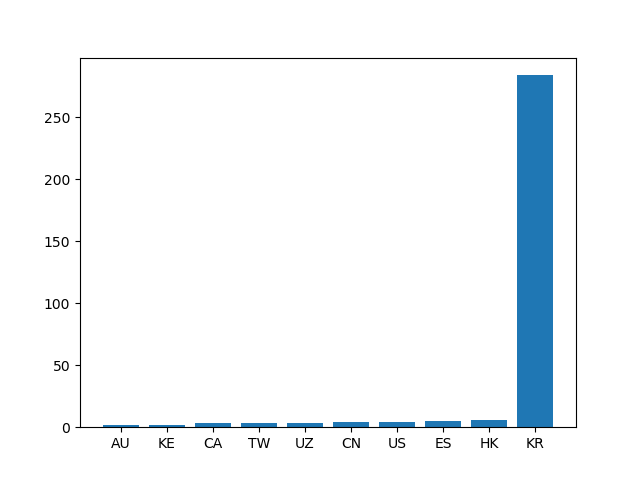
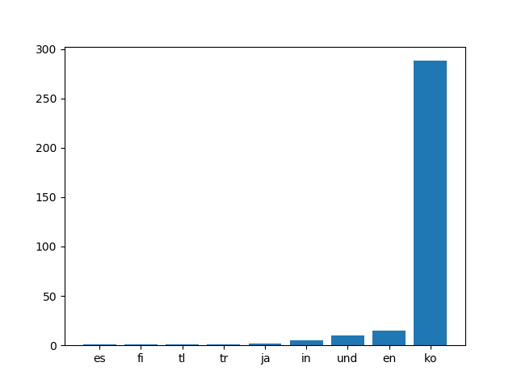
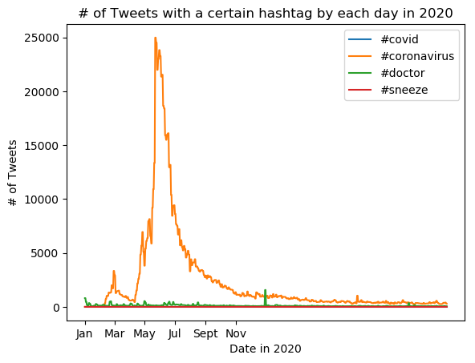

# Coronavirus twitter analysis

## Background

**About the Data:**

Approximately 500 million tweets are sent everyday.
Of those tweets, about 2% are *geotagged*.
That is, the user's device includes location information about where the tweets were sent from.
The lambda server's `/data/Twitter dataset` folder contains all geotagged tweets that were sent in 2020.
In total, there are about 1.1 billion tweets in this dataset.

The tweets are stored as follows.
The tweets for each day are stored in a zip file `geoTwitterYY-MM-DD.zip`,
and inside this zip file are 24 text files, one for each hour of the day.
Each text file contains a single tweet per line in JSON format.
JSON is a popular format for storing data that is closely related to python dictionaries.

**Description of the Data Analysis:**
The goal of this data analysis is to process and visualize tweets from 2020 that contain hashtags related to the coronavirus pandemic. By separating the tweets by geotag and language, we are able to visualize trends in the usage of certain hashtags based on country and based on language. We are also able to see the frequency with which each hashtag is used, and we are able to observe a large increase in the usage of many disease and pandemic-related hashtags as news of the pandemic spread throughout the globe in early 2020.

## Images

**Task 3 graphs:**
The following graphs display the usage of a certain hashtag, first by country, and second by language. As expected, #coronavirus is used most often in the English language, while #코로나바이러스 is used most often in the Korean language.

**Task 4 graphs:**
The following graph shows the number of tweets sent on each day of 2020 that contain the #coronavirus hashtag.

